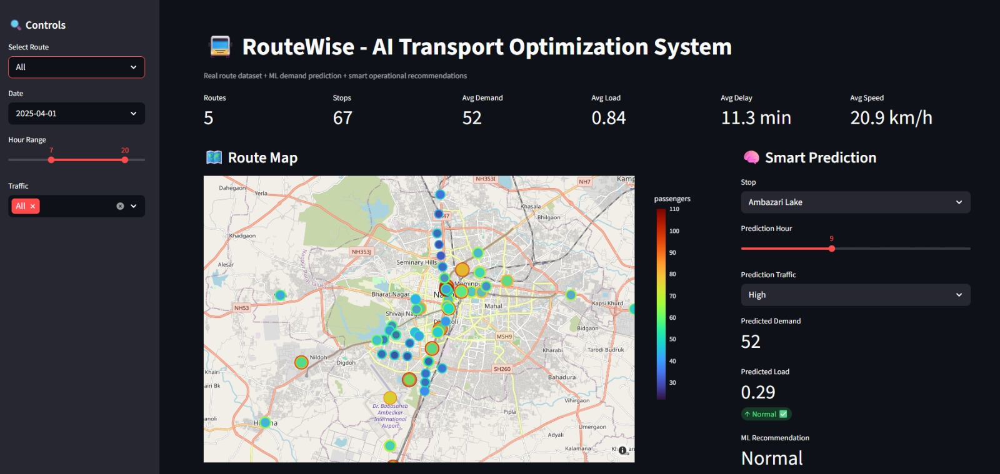
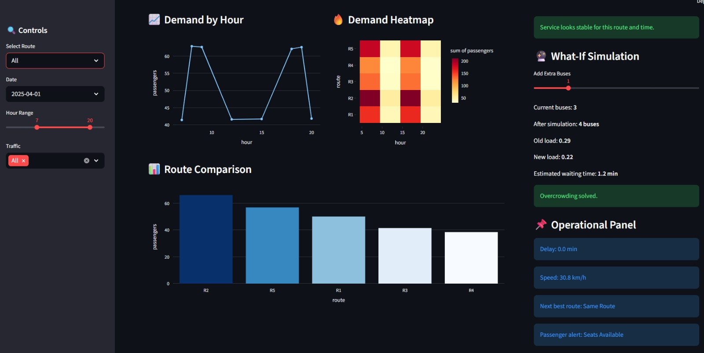

# 🚍 RouteWise - AI Transport Optimization System

An intelligent **Public Transport Analytics & Optimization System** built using **Machine Learning + Interactive Streamlit Dashboard** to reduce overcrowding, improve scheduling, and enable smarter urban mobility decisions.

---

## 🌐 Live Demo

👉 **Try the Live Project:**  
https://routewise---ai-transport-optimization-system-yssewfosdumjt9kfg.streamlit.app/

---

## 📂 GitHub Repository

👉 **View Source Code:**  
https://github.com/shreya975/RouteWise---AI-Transport-Optimization-System

---

## 📌 Problem Statement

Traditional public transport systems operate on **fixed routes and schedules**, while real-world passenger demand changes continuously.

This creates issues such as:

- 🚨 Overcrowded buses during peak hours  
- 🚌 Underutilized buses during off-peak hours  
- ⏳ Delays and poor commuter experience  
- ⛽ Fuel and resource wastage  

RouteWise solves this using **AI-powered demand prediction and smart optimization.**

---

## 🔥 Core Features

- 📊 Passenger Demand Prediction using Machine Learning  
- 🚦 Traffic-Aware Decision System  
- 🧠 Smart Service Recommendations  
- 🗺️ Interactive Route Map Visualization  
- 🔮 What-If Simulation (Add Extra Buses)  
- 📈 Demand Heatmaps & Trend Analysis  
- ⚠️ Overcrowding Detection  
- 🔄 Alternative Route Suggestions  
- 📋 Route Comparison Dashboard  

---

## 🧠 System Intelligence

The system automatically suggests actions such as:

- ➕ Add Extra Buses  
- 🔁 Reroute Vehicles  
- ⏱ Increase Service Frequency  
- 🛑 Reduce Frequency During Low Demand  
- ✅ Continue Normal Operation  

### 📌 Decisions are based on:

- Passenger Load  
- Traffic Conditions  
- Delay Time  
- Peak Hours  
- Route Demand Patterns  

---

## ⚙️ How It Works

1. Collect transport and demand-related data  
2. Process data and create smart features  
3. Use Random Forest ML Model for demand prediction  
4. Analyze crowd level and route efficiency  
5. Generate recommendations instantly  
6. Display outputs through dashboard visualizations  

---

## 📂 Dataset Features

- Route & Stop Data  
- GPS Coordinates (Latitude / Longitude)  
- Passenger Demand Count  
- Traffic Levels  
- Delay & Speed Data  
- Bus Load Factor  
- Bus Count  
- Travel Distance & Time  
- Peak Hour Indicators  
- AI Recommendation Fields  

---

## 🛠️ Tech Stack

- Python 🐍  
- Streamlit 🌐  
- Scikit-learn 🤖  
- Pandas 📊  
- NumPy 🔢  
- Plotly 📈  
- Folium 🗺️  

---

## ▶️ Run Locally

    git clone https://github.com/shreya975/RouteWise---AI-Transport-Optimization-System.git
    cd RouteWise---AI-Transport-Optimization-System
    pip install -r requirements.txt
    python -m streamlit run app.py

---

## 📸 Dashboard Preview

---

## 💡 Future Improvements

- 🚦 Live Traffic API Integration  
- 📍 Real-time Bus GPS Tracking  
- 🌦️ Weather-Based Demand Prediction  
- 📱 Passenger Mobile App  
- 🎫 Smart Ticketing Integration  
- 🏙️ Government Smart City Deployment  
- 🚇 Multi-Modal Transport Sync (Bus + Metro)  
- 🤖 Deep Learning Based Demand Forecasting  
- 📊 Advanced Admin Analytics Dashboard  

---

## 🏆 Project Background

Built as a solution during a **24-Hour Hackathon at VNIT** to solve real-world transport challenges using **AI, Machine Learning, and Data Analytics**.

The goal was to create a smart transport system that can predict passenger demand, optimize routes, and improve urban mobility efficiency.

---

## ❤️ Final Thought

> RouteWise doesn’t just move people — it moves cities intelligently.
